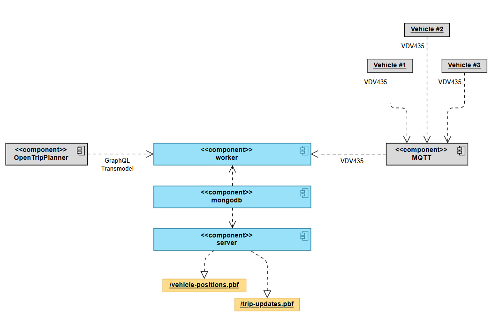

# How It Works
Matching raw AVL data to public transport trips in realtime without any further meta information can be quite challenging. There're only a few information which can be used for comparing the AVL data with nominal data and find a good match. Furthermore, this package should not just be another proprietary implemented AVL matching service, but use well-known and defined standards for reproducability and integration.

This document describes the general architecture and technology used by avl2gtfsrt under the hood. The following diagram shows the complete architecture:



Components in blue or yellow are part of `avl2gtfsrt`, all other components are external components. In particular, there're have:

- The `worker` which does all the communication to the MQTT broker and the entire matching
- A `mongodb` used for storing the current status and realtime objects
- And a `server` used for providing GTFS-RT feeds reachable at `/vehicle-positions.pbf?debug` and `/trip-updates.pbf?debug`

## About The Internet Of Mobility
The Internet of Mobility (IoM) is one of the results of a German research project called [ÖV-Leitmotif-KI](https://www.vdv.de/leitmotif-ki.aspx). Instead of using dedicated and complex server infrastructures, IoM aims to use developed and widely used communication technology and data formats we all know from the Internet of Things. A MQTT broker offers realtime communication at low bandwith and is nearly independend of the data which shall be transmitted and also ensures data security and authenticity by authentication add-ons. Hence, implementations can focus on data and process modelling completely.

IoM defines several messaging protocols, two of them are mainly used in `avl2gtfsrt`. In general, a vehicle can have different states:

- **technically logged off**: The vehicle is has no active connection to the IoM backend.
- **technically loggend on**: The vehicle has an active connection to the IoM backend.
- **operationally logged on**: The vehicle is technically logged on and the IoM backend also knows about the service, the vehicle is currently running on.

Normally, the **operational log on** is performed by the driver of the vehicle. However, in an autonomous vehicle without a driver or an automatic system like `avl2gtfsrt`, the **operational log on** is performed by the IoM backend, whereas the vehicle is informed about that state using a message over the MQTT broker. A **technical log off** implies also an **operational log off** at the IoM backend. 

When a vehicle is **technically logged on**, it may publish its own physical position to the MQTT broker into a dedicated topic (e.g. `IoM/1.0/DataVersion/2025/Country/de/any/Organisation/TEST/any/Vehicle/VEHICLE-1/any/PhysicalPosition/GnssPhysicalPositionData`) for the actual vehicle. A message like that in XML representation may look like this:

```xml
<?xml version="1.0" encoding="utf-8"?>
<GnssPhysicalPositionDataStructure version="1.0">
	<Timestamp>2025-10-14T10:31:28+02:00</Timestamp>
	<TimestampOfMeasurement>2025-10-14T10:31:28+02:00</TimestampOfMeasurement>
	<PublisherId>ITCS435-TEST</PublisherId>
	<GnssPhysicalPosition>
		<WGS84PhysicalPosition>
			<Latitude>51.406083</Latitude>
			<Longitude>9.718255</Longitude>
		</WGS84PhysicalPosition>
	</GnssPhysicalPosition>
</GnssPhysicalPositionDataStructure>
```

The implementation of `avl2gtfsrt` uses exactly those messages to process AVL data in fact.

## Matching Process
In fact, there're only two criteria to match raw AVL data to a certain trip: Spatial information about the particular route and temporal information based on stop times of the trip. Matching in `avl2gtfsrt` works with a two-step mechanism considering spatial data at first and enriches results found by temporal matching.

In general, `avl2gtfsrt` **requires a vehicle to move** to trigger the matching process. When a vehicle _not operationally logged on_ appears to send GNSS position updates to the IoM backend of `avl2gtfsrt`, the _nominal data client_ is called to find _20 possible trip candidates departing at the closest station with a review time window of 15 minutes_. The review time is required to also find also trip candidates which should already be departed regarding their schedule. 

The following matching steps are performed for all possible trip candidates, until one matching trip is found.

### Spatial Matching
Simply matching one single GNSS position does not solve any problem at all: By watching just at one single GNSS position, all trips with a shape touching the last known GNSS position exactly once can be found. Imagine a transit network with several lines crossing each other, you will see too many possible trips which are definitely not served by this vehicle. The key is to track **a trajectory of up to 12 GNSS positions out of the last 60s** of this vehicle. By looking at this trajectory, it is monitored _where the vehicle actually is_ and _where it is coming from_. 

This information is used to check whether the movement of _the last 60 seconds_ is matching a particular trip candidate. Spatial matching then works quite easy:

- A buffer of **30 meters** is built around the trip shape polyline. This ensures that even noisy GNSS data can be processed without leaving to much accurancy.
- If **at least 60% of the trajectory** matches the trip shape, the trip is further considered as candidate. Otherwise the trip is discarded here.
- If the trajectory is **moving forward with a ratio of at least 75%** (imagine a vehicle standing at a stop for a few seconds with noisy GNSS), the trip is considered as match. Otherwise the trip is discarded here.
- Finally, the spatial matching score is calculated **as product of the total-match-ratio and the forward-movement-ratio**.

If a trip has passed this stage, it is considered as candidate for temporal matching.

### Temporal Matching
Especially when there're multiple trip candidates with a nearly equal spatial match (imagine two routes travelling the same way), the temporal component must also be considered to find the trip with the highest probability for a match. Temporal matching is done with the following steps:

- First of all, it is checked that the trip is running currently based on its nominal stop times. If the trip is not running currently, it is discarded here.
- Then the **temporal progress percentage** is calculated using the nominal stop times of the trip.
- Based on the last known GNSS position, the **spatial progress percentage along the shape** is calculated.
- If the **deviation between the spatial and the temporal progress percentage is lesser or equal to 30%**, the trip is further considered as candidate. Otherwise the trip is discarded here.
- Finally, the temporal matching score is calculated **as an inverted percentual representation of the former calculated deviation**. If a vehicle appears to run too early on a certain trip, the temporal matching score **is dampened by factor 0.8** in order to prefer delayed trips, as this is the most common scenario.

Multiplying the **spatial match score** and the **temporal match score** leads to a **total match probability** for each trip after applying a [softmax activation](https://de.wikipedia.org/wiki/Softmax-Funktion). In an optimal situation, there's one single trip left which then is our matched trip candidate, which simply has a probability of 1.0 then.

### Bayesian Learning On Trips
In a real life scenario, the matching ends up with several trip candidates with distributed probabilities. Based on these probabilities, there is no opportunity to match a certain trip unambiguously. Furthermore, the possible trip candidates need to be manifested or release in several iterations. To enforce a continuous adaption of the probabilities even when the vehicle movement would match several possible trips nearly equally, [bayesian inference](https://en.wikipedia.org/wiki/Bayesian_inference) is used. This kind of machine learning uses probabilities of former iterations and combines them with the actual probabilities to differentiate the trip candidates from each other. A high probability leads to a slightly higher probability after applying the next bayesian update. In other words, the vehicle is slowly 'learning' which trip it is serving actually.

 In this process the whole chain of spatial and temporal matching is repeated in many iterations as long as the trip appears in the nominal candidate list until **a) only one trip candidate is left** or - this is the more realistic case - **b) a convergence can be found in the single probabilities** of each trip. A convergence means, the best matching trip has not improved its probability for the last few iterations significantly and then is considered to be the matched trip to have a termination criteria for the matching.

 ## Further Processing
 After finding the matching process, the IoM backend performs an **operational log on** for the particular vehicle and excludes it from the entire matching cycle on each GNSS position update.

 After the vehicle is _operationally logged on_ successfully, with every GNSS position update the data in the object storage are updated and a simple test is performed, whether the last GNSS trajectory still matches the formerly matched trip. If this test fails for **three times in a row**, the vehicle is **operationally logged off** and released to the entire matching cycle again.